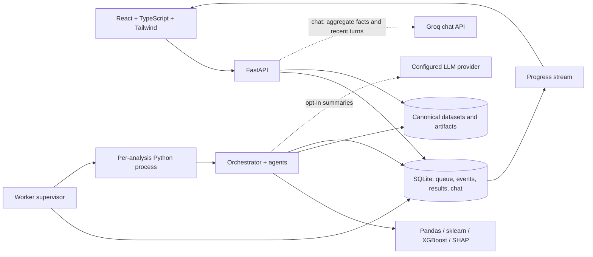

# Architecture

## Runtime boundaries

The HTTP process validates requests and persists jobs; it does not run training in a request handler. A separate worker atomically claims the oldest queued job. It launches a spawned process, monitors its wall-clock time and process-tree RSS, writes a heartbeat, and handles cancellation. SQLite WAL allows the API and worker to share a local persistent database. Run one worker by default. Multiple hosts must not share this SQLite file over network storage; migrating to a server database and dedicated task queue would be a separate scaling change.

FastAPI serves the frontend production build and exposes authenticated prediction/report endpoints. Vite is only required for development or asset compilation.

## Groq chat boundary

`tools/groq_chat.py` calls Groq's fixed HTTPS chat-completions endpoint using `httpx`; credentials are read from the server environment. AI Chat uses Groq directly; API clients can explicitly request the local provider. It is independent of the optional analysis LLM setting. The endpoint requires a completed analysis and builds an allowlisted aggregate context, excludes raw rows/predictions/local explanations, and includes at most four recent chat turns with bounded lengths. The system prompt distinguishes analysis facts from instructions and limits answers to explanations; no tools or code execution are exposed.

Transient failures have three bounded attempts, configurable HTTP timeouts, and capped retry delays. Error messages are sanitized, invalid/empty/truncated answers are rejected, and only successful question/answer pairs are saved to SQLite. The frontend displays the Groq model badge, context-sharing disclosure, missing-key setup guidance, and request errors. Health reports configuration availability and model name, never the key. Groq receives user-authored goals/questions as text, so exclusion of dataset rows is not a guarantee that arbitrary chat content contains no private data.

## Agent contracts

All agent classes implement `run(context, settings, project_path, event)` and return JSON-safe evidence. Class definitions live in `backend/app/agents/stages.py`; orchestration and checkpoints live in `orchestrator.py`.

| Agent | Responsibility |
| --- | --- |
| Problem Understanding | Resolve task and target; reject unsupported temporal tasks. |
| Planner | Record execution plan; optionally add LLM rationale. |
| Data Profiling | Column types, missingness, cardinalities, duplicates, statistics. |
| Cleaning | Trim values, normalize non-finite values, remove exact duplicates and missing targets. |
| EDA | Histograms, category counts, correlations, IQR outlier counts. |
| Feature Engineering | Split data, exclude unsafe/unusable predictors, define fold-fitted transforms. |
| Model Selection | Choose eligible candidate families according to task and row count. |
| Training | CV, tuning, fitted pipelines, candidate cache, validation leaderboard. |
| Evaluation/Critic | Held-out and baseline metrics, overfit/leakage warnings, saved model. |
| SHAP Explainability | Global importance and local additive explanations of actual model outputs. |
| Business Insight | Grounded summary/actions; optional separately labeled LLM commentary. |
| Report | Escaped HTML, paginated PDF, structured JSON, artifact metadata. |
| Orchestrator | Execute agents in order, emit events, checkpoint state, resume or record failure. |

These are explicit Python components, not independent LLM personas. All numeric results are calculated by Python. LLM responses can only populate bounded narrative fields. They cannot choose executable code, invoke tools, change model metrics, read local files, or control the orchestrator.

## Statistical protocol

1. Parse bounded CSV/flat JSON and persist a canonical CSV. A SHA-256 fingerprint identifies the canonical data plus request parameters and pipeline version.
2. Normalize cell values, remove identical full rows, and remove rows without a target. No learned imputation occurs yet.
3. Normally split 80/20 with a reproducible seed, stratifying classification. For small classes, adjust the per-class holdout to preserve at least two training observations and one test observation per class. Reduce CV folds to fit the smallest training class. Never duplicate observations across train/test or silently drop rare labels. The test partition is not used in candidate ranking or tuning.
4. Use only outer-training data to exclude IDs, constants, mostly empty features, high-cardinality categories, exact target copies, and near-perfect numeric target proxies. These are heuristics, not proof that leakage is absent. User-selected features still undergo these checks.
5. Inside each CV training fold, fit median imputation, missing indicators, numeric scaling, categorical imputation, and bounded one-hot encoding as part of the estimator pipeline. The same pipeline handles later predictions. Outer-training preprocessing is also fitted to check the encoded feature budget; this fitted copy is not reused as a fitted CV transform.
6. Tune and rank candidates using mean macro F1 for classification, negative RMSE for regression, or held-out-fold silhouette for clustering. Classification uses stratified CV. The selected model is refitted on the outer-training partition. The baseline can win.
7. Evaluate the selected model and baseline once on the test partition. Classification reports accuracy, balanced accuracy, macro F1, confusion matrix, and ROC AUC when defined. Regression reports RMSE, MAE, and R². Clustering reports observed clusters, silhouette when defined, and Davies–Bouldin score; a one-cluster reference has no meaningful silhouette.
8. Compare training performance with cross-validation performance for overfit warnings; check shared predictor vectors across train/test partitions. Random splits do not validate future, grouped, repeated-entity, or intervention performance. Forecasting requests are explicitly rejected; users must investigate possible repeated-entity leakage.

Whole-dataset EDA is descriptive and does not feed target-based candidate selection. Review inferred task and target; the default heuristic may be wrong for an unfamiliar schema. No automated “leakage detected” label is a comprehensive guarantee.

Target validation is shared by the form, submission/retry API, and agents. Replacing a dataset resets the task to auto and clears the old target and irrelevant sample goal. IDs are not eligible targets; ambiguous goals require an explicit outcome. Continuous numeric measurements use regression in auto mode. Neural networks disable their extra internal early-stopping split when classes are too small for it, while retaining bounded epochs and cross-validation.

## SHAP and interpretation

Tree models use Tree SHAP when supported. Other models use permutation SHAP with a bounded training background and up to ten held-out rows. Global importance is the mean absolute SHAP over those sampled explanations, not a claim to summarize every row. The UI exposes local contributions, base value, predicted output, and the additivity residual. Omitted local features are accounted for in the stored sum. Classification explains the predicted class probability; regression explains the predicted value; clustering explains negative distance to the assigned center. Unsupported/constant baselines return an explicit not-applicable result.

Feature names may be encoded categories or missingness indicators. SHAP describes model associations; it does not establish causal drivers or financial return.

## Persistence, checkpoints, and failure handling

`data/workspace.sqlite3` stores datasets, requests, statuses, checkpoints, events, and chat. Each `projects/<analysis UUID>/` contains atomic checkpoint Joblib files, fitted candidate cache files, the final `model.joblib`, cleaned/prediction CSVs, and HTML/PDF/JSON reports. Partial files are written to a temporary sibling and atomically replaced. A checkpoint contains the intermediate Python context, including split indices and fitted models. Database summaries are JSON-safe and UI-readable.

Retries reuse checkpoints only if the fingerprint matches. Completed candidates can be reused when training itself was interrupted. Caching is scoped to a particular analysis; separate submissions create separate projects. Bump the pipeline fingerprint version when computation semantics change, and create a new analysis after dependency/model-format changes. Do not load old Joblib files across incompatible sklearn versions.

Transient agent connection/timeouts get one retry. The LLM client retries transient HTTP/network failures, validates JSON, and falls back for planning/insights. Invalid input is reported rather than repeatedly retried. A stale worker heartbeat marks a running job interrupted; resumption is explicit, preventing an unbounded automatic retry loop. A retry is subject to the queue capacity. Timeout and memory termination retain completed checkpoints.

## Security and deployment scope

This release is a **single shared workspace**: every holder of the application API key can access all datasets and analyses. Production mode requires a secret of at least 32 characters. Browser application credentials are stored in session storage; LLM credentials remain server-side. Add an identity-aware gateway, TLS, request-rate/concurrency controls, audit policy, storage quotas, and retention appropriate to the deployment. Tenant authorization, encryption at rest, and automatic data retention are not implemented here.

Uploads are bounded before multipart parsing and limited to CSV/JSON. UUID routing and an artifact allowlist prevent arbitrary path access. There is no uploaded-pickle loader or arbitrary SQL/URL ingestion. Generated HTML and PDF text is escaped; CSV downloads neutralize formula-leading string values and column names without modifying training inputs. JSON exports preserve original values. Treat artifacts as private data: reports include previews and schema, and checkpoints contain datasets and models.

Only server-generated Joblib artifacts are loaded. Joblib is executable serialization; never replace checkpoints/models with untrusted files. Python process isolation provides cancellation/resource supervision, not a security sandbox for arbitrary code. Container settings provide an additional boundary. The API health endpoint checks the HTTP service only; it is not a worker readiness check. Monitor queue age, worker logs, disk usage, and backup success in deployment.

Docker build/runtime has not been tested on this machine. The Dockerfile includes libgomp for XGBoost, builds frontend assets in Node, and runs the Python service as a non-root user. Compose supplies separate API/worker limits and persistent volumes. Pinned dependencies are the versions exercised on Windows/Python 3.12; verify Linux wheels, image scanning, and target-host performance before deployment.

## EDA dataset dashboard

The Reports page embeds the same dataset-bound `EDADashboard` inside `MainReport`, alongside the saved workflow's profile, preparation, leaderboard, evaluation, explanations, and recommendations. Switching analyses remounts the report and cancels obsolete EDA requests. The preview remains limited to five rows.

`reporting/reports.py` builds one structured outline for HTML and PDF. ReportLab draws vector bar charts, a bounded heatmap, and scatter points; HTML embeds their SVG representation and PDF embeds the drawing directly. PDF tables repeat their headers and chart introductions stay with their figures. Uploaded text is escaped. New workflow reports include original-upload EDA plus dataset/request metadata. Existing report downloads compute missing EDA from the canonical saved CSV and render to memory, preserving existing models, checkpoints, and result records. This requires the original dataset to remain available for legacy runs, and adds rendering work to download requests.

`tools/dashboard.py` computes descriptive statistics on the original uploaded data. Authenticated read-only dataset library, EDA, and relationship endpoints are independent of analysis runs and checkpoints. `EDAWorkspace` selects an upload and `EDADashboard` renders responsive SVG charts and accessible data tables. Correlations use pairwise non-missing values; undefined correlations stay null. Identifier columns are available for distribution inspection but excluded from default relationships and the bounded correlation map. Scatter points use a deterministic 600-row sample; correlation and axis bounds use all valid pairs. Changing a dataset or axis aborts obsolete requests. Original datasets are retained when saved analysis runs are cleared.
